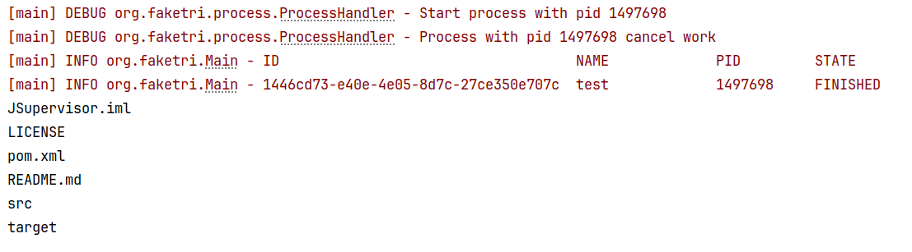

# JSupervisor

**JSupervisor** — простой менеджер процессов на Java, позволяющий запускать приложения, отслеживать их состояние и получать вывод логов в реальном времени.



## Возможности

* Запуск и управление процессами.
* Отслеживание состояния запущенных процессов.
* Чтение `stdout` и `stderr` процесса.
* Подключение слушателей для обработки логов.
* Вывод логов:

    * в терминал;
    * в файл.
* Конфигурация процессов через `.yaml`-файлы.
* Запуск нескольких процессов из одного конфигурационного файла.
* Группировка процессов по профилям.
* Настройка политики перезапуска процесса.

## Конфигурация

JSupervisor поддерживает конфигурацию процессов через YAML.

Пример:

```yaml
app:
  test:
    command:
      - ls
    restartPolicy: ALWAYS
    profile: DEFAULT
```

### Параметры

| Параметр        | Описание                                    | Значение по умолчанию |
| --------------- | ------------------------------------------- | --------------------- |
| `command`       | Команда и её аргументы для запуска процесса | —                     |
| `restartPolicy` | Политика перезапуска процесса               | `NEVER`               |
| `profile`       | Профиль, к которому относится процесс       | `DEFAULT`             |

### Политика перезапуска

Поддерживаются следующие значения `restartPolicy`:

* `ALWAYS` — перезапускать процесс независимо от причины завершения.
* `NEVER` — не перезапускать процесс.
* `ON_FAILURE` — перезапускать процесс только при завершении с ошибкой.

`restartPolicy` и `profile` являются необязательными параметрами. Если они не указаны, используются значения по умолчанию:

```yaml
restartPolicy: NEVER
profile: DEFAULT
```

## Несколько процессов

В одном YAML-файле можно определить несколько приложений:

```yaml
app:
  server:
    command:
      - java
      - -jar
      - server.jar
    restartPolicy: ALWAYS
    profile: DEFAULT

  worker:
    command:
      - ./worker
    restartPolicy: ON_FAILURE
    profile: WORKERS

  test:
    command:
      - ls
    profile: DEFAULT
```

## Профили

Процессы можно объединять в профили. Это позволяет запускать несколько процессов, относящихся к одной группе.

Например:

```yaml
app:
  backend:
    command:
      - java
      - -jar
      - backend.jar
    profile: DEV

  frontend:
    command:
      - npm
      - run
      - dev
    profile: DEV

  database:
    command:
      - postgres
    profile: DATABASE
```

В данном примере `backend` и `frontend` относятся к профилю `DEV`, а `database` — к профилю `DATABASE`.

## Логи

JSupervisor позволяет получать вывод запущенных процессов через слушателей.

Логи могут направляться:

```text
Process
   │
   ├── stdout ──► Listener ──► Terminal
   │
   └── stderr ──► Listener ──► File
```

Таким образом, вывод процесса можно обрабатывать или перенаправлять в различные источники без изменения самого процесса.

## Состояние процесса

Для каждого запущенного процесса JSupervisor позволяет отслеживать его текущее состояние.

Это позволяет контролировать:

* запущен ли процесс;
* завершился ли процесс;
* завершился ли процесс с ошибкой;
* требуется ли его перезапуск в соответствии с `restartPolicy`.

## Пример

Минимальная конфигурация:

```yaml
app:
  test:
    command:
      - ls
```

В этом случае:

* будет запущен процесс `ls`;
* `restartPolicy` будет `NEVER`;
* профиль будет `DEFAULT`;
* вывод процесса может быть передан подключённому listener'у.

## Статус проекта

Проект находится в стадии разработки. Функциональность и формат конфигурации могут изменяться.
